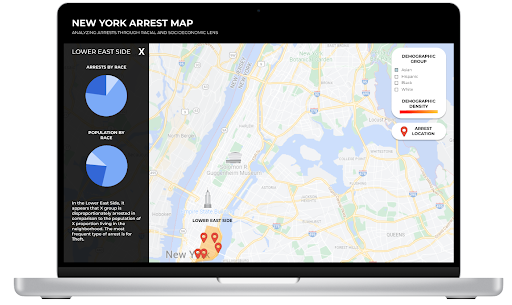

This week our group discussed goals for our website, including what we wanted it to look like, what purpose we wanted it to serve, as well as the data we would draw our analysis from. Below is a breakdown of our takeaways!

# Useful Sites:
+ https://milliondollarhoods.pre.ss.ucla.edu/: utilizing jail and arrest data and pairing that with collected oral histories, the Million Dollar Hoods research team was able to craft an impacful narrative detailing more than 5 decades of mass incarceration in minority communities. The data analysis was used to launch social justice initiatives – this inspires our team to craft something similar for our website; we don’t want to showcase just a narrative, but inspire action and desire for change. Our goal is to analyze how racial and socioeconomic factors are associated with arrests in NYC, which is very similar to the Million Dollar Hoods vision → this website serves as a framework for success. We would love to tie in non-quantitative data into our map to enrich the story we are telling
+ https://redbird.shinyapps.io/police-bias-map/: Police Bias Map displays black to white arrest risk ratio for all the counties in the US. Reveals the racial disparities present – Black individuals are much more likely to be at risk of getting arrested in more counties than white individuals. Inspires us to draw similar meaningful conclusions from our analysis – we want to highlight the disparities that may be present in NYC with our project. The stark contrast apparent in the map helps solidify the statement the mapping website is making.

# Datasets
+ https://data.cityofnewyork.us/Public-Safety/NYPD-Arrests-Data-Historic-/8h9b-rp9u/data: This dataset contains a list of every single arrest in NYC up till the end of 2021. Variables of interest include the reason for arrest, the perpatrator race and sex, as well as the exact coordinates of where the crime was committed. We plan on utilizing this dataset as the core component of our analysis; the locations of every arrest will be plotted using the given coordinates and the racial data points associated with those coordinates will be marked as well. 
+ https://data.cityofnewyork.us/Public-Safety/Crime-Map-/5jvd-shfj: This dataset includes all valid felony, misdemeanor, and violation crimes reported to the New York City Police Department (NYPD) in the year 2016. The data provides specific offense descriptions, as well as specific location descriptions, accompanied by coordinates. We plan on using these coordinates to map out the frequency of crimes in different locations across NYC

# Our Website Design!
The website will display information for each sub-borough of NYC. We will showcase the population density for each racial group in that region, and also display the arrests for the selected racial group as well. These filters can be toggled using a menu on the map. 
+ We hope for our website to be interactive in date and time of crimes, allowing users to view visualized data from specific time regions that our data spans through. 
+ Color scheme: black background (night-mode feel), various shades of blue, red-orange-yellow scale to assess severity of the levels of crime in NYC.
+ When the website is first opened, it will display a map of NYC in full, color coded to represent crime rates. When the mouse is hovered over each sub-borough, racial group data will become present, allowing users to understand how to accurately interact with the map.
+ We may also include a short statement on the main menu guiding users in interacting with our map in the most efficient way. 
+ We could implement tabs in the project. Either at the top or side. Tabs can include home page, maybe narrative to explain whats going on and also about us page.

# Goal of Site
We hope this site will highlight the injustices with racial profiling when it comes to arrests in New York City. The goal of our mapping project is to reveal the disparities that may be present amongst different racial groups in relation to the frequency of arrests as well as the proportion of arrests to the population proportion in a given area.

# Progress and Responsibilities
These are the different things we each focused on this week:
+ **Christina**: Researched various design features and layouts we can implement into our website to best represent our data and topic and enhance the user experience. 
+ **Cynthia**: Reviewed datasets to determine what analyses can be performed, drafted up a rough outline of the final site. Responsibilities as a data analyst include cleaning up our data and preparing it for mapping, and determining how we are going to utilize our selected datasets. 
+ **Daniel**: Researched on different design elements that could be implemented into the project.
+ **Kristina**: Did outside research about racial demographics in NYC sub-boroughs to provide applicable analysis to our mapping results. Documented sources that will potentially be relevant as we move forward with our analysis. Viewed other sites with similar topics to get inspiration for the design and feel of our website. 

