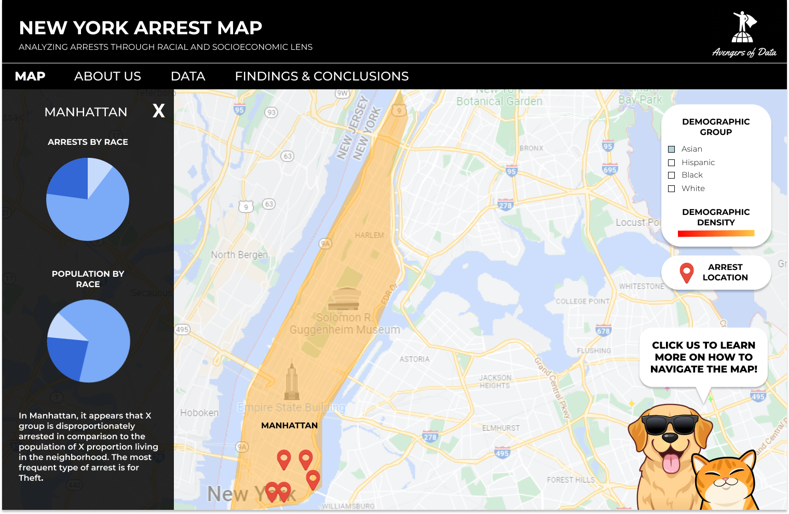

# Proposal

## Introduction
Our team name is: The Avengers of Data and our project will focus on crime data in New York City, with a particular emphasis on analyzing how socioeconomic and racial factors are correlated with the reporting and police response to crime. Our goal is to highlight how racial profiling affects certain groups in NYC and identify the groups that are more frequently subjected to criminalization.

## Meet the Team!
| Christina Cha | Cynthia Gong | Daniel Fouladian | Kristina Thabet |
|:---:|:---:|:---:|:---:|
| Designer | Data Analyst | Data Analyst | Writer / Data Analyst |
| Christina is a third year majoring in Business Economics and minoring in Digital Humanities. Professionally, she is interested in marketing, specifically product marketing, for the tech and entertainment industry. In her free time, she loves spending time with her cat and family. | Cynthia is a third year studying Statistics and Digital Humanities. She’s interested in real estate, urban planning, and the entertainment industry. In her free time, she enjoys taking care of her houseplants and painting landscape scenery | Daniel Fouladian is a senior pursuing a B.A in Psychology with a minor in Digital Humanities (2022). He continues to succeed academically as he was born deaf and wears a Cochlear Implant to hear. He hopes he can inspire many more to overcome their obstacles and hardships. In his free time, he loves to play sports and create using graphic design. | Kristina is a senior pursuing a BS in Economics with a minor in Digital Humanities. Professionally, she is interested in social media marketing and fashion styling. In her free time, she loves sourcing vintage clothing and relaxing with friends and family. |
|  ||  |  |

## Overview
We will be using NYPD criminal record data in combination with NYC's demographical data to compare and contrast common crimes that occur in different boroughs. Our work will center around analyzing the tpes of crimes different groups in New York are arrested and convicted for, hopefully making a strong comment on not only the racial profiling present in NYPD, but how economic status and opportunity play a part in criminal behavior. We hope for our work to be an educational resource for those looking to gain knowledge about criminal activity in all regions of New York. 

## Methodology
We will be using web mapping as our methodology of inquiry to provide a more comprehensive and interactive investigation into our data. Contextualizing arrest data and crime statistics can often be difficult without seeing the location of where these crimes occured. This is because crime itself tends to be a location-based phenomenon, where certain locales tend to be more prone to crime than others. As a result, it is important we visualize our data points on a map.

We plan on creating a multi-layered map that will provide a narrative on racial profiling by NYPD as well as a general comparison between crime and racial/socioeconomic background. The main feature of the map is to display demographic information for each neighborhood and compare it to the density of arrests in that neighborhood by racial background. Our arrests will be pinned onto the map by markers, enabling viewers to understand the arrest patterns by NYPD. 

## Workflow
| | | 
|:---:|:---:|
| Meetings | We will have weekly meetings on Zoom. After each meeting, we will have a deadline for tasks outlining our deliverables for next week. During the meetings, we will go over our progress. Furthemore, we plan on having one person screensharing so we can do pair programming where one of us codes and the remaining of us serve as navigators. |
| Communication | Communication outside of meetings will be handled on Slack. |

Schedule:
+ **Week 4**: Have a rough working map after cleaning data and solidifying our narrative
+ **Week 5**: General layout of webpage such as sidebar elements and additional features
+ **Week 6**: Have UI elements implemented into the project
+ **Week 7**: Have all of our data points finalized and begin writing the story element of the web map
+ **Weeks 8-10**: Finalize our analysis and perform quality assurance.

## Technical Scope
We will be embedding Leaflet into our JavaScript code in orderto create an interactive map of criminal activity in New York City. We will also use HTML to put our website together in a meaningful and aesthetic way. GitHub will be used as a tool to merge our individual code blocks, publish our progress from each week, and host our final product. CSS will be used for the design element of our webpage while Javascript will allow the project to have interactive elements. 

## Geographic Scope
Our map will be at the city-level, and will focus on New York City and its five boroughs.

## Data: 

https://data.cityofnewyork.us/Public-Safety/NYPD-Arrests-Data-Historic-/8h9b-rp9u/data

This dataset contains a list of every single arrest in NYC up till the end of 2021. Variables of interest include the reason for arrest, the perpatrator race and sex, as well as the exact coordinates of where the crime was committed.

Data will be exported from the website as a CSV file from the given link and geocoded using JavaScript. Each category of data by perpetrator_race will be a separate layer on the map, and toggles will allow users to view one or more layers at the same time. Likewise, using the field arrest_date, we will also create a time filter that allows users to select which years they want to see arrest data from. Narratives will be driven by combining the offense description, arrest date, and details about the perpetrator as a pop-up box when a marker is clicked.

https://data.cityofnewyork.us/Public-Safety/Crime-Map-/5jvd-shfj: This dataset includes all valid felony, misdemeanor, and violation crimes reported to the New York City Police Department (NYPD) in the year 2016. The data provides specific offense descriptions, as well as specific location descriptions, accompanied by coordinates. 

This data will be exported as a CSV from the given link and geocoded using Javascript. The data points from this map, primarily the offense description and the date of complaint, will be integrated as a separate layer that can be toggled on and off as well. 

This data will be exported as a CSV from the given link and geocoded using Javascript. The data points from this map, primarily the offense description and the date of complaint, will be integrated as a separate layer that can be toggled on and off as well. 

## UX Components
### Figma Wireframes

