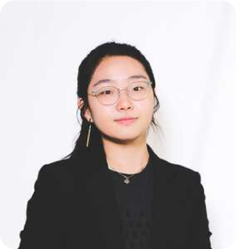

# Thick Map Proposal

Our team name is: [insert name] and our project will focus on crime data in New York City, with a particular emphasis on analyzing how socioeconomic and racial factors are correlated with the reporting and police response to crime.

## Meet the Team!
| Christina Cha | Cynthia Gong | Daniel Fouladian | Kristina Thabet |
|:---:|:---:|:---:|:---:|
| Designer | Data Analyst | Data Analyst | Writer / Data Analyst |
| Christina is a third year majoring in Business Economics and minoring in Digital Humanities. Professionally, she is interested in marketing, specifically product marketing, for the tech and entertainment industry. In her free time, she loves spending time with her cat and family. | Cynthia is a third year studying Statistics and Digital Humanities. She’s interested in real estate, urban planning, and the entertainment industry. In her free time, she enjoys taking care of her houseplants and painting landscape scenery | Daniel Fouladian is a senior pursuing a B.A in Psychology with a minor in Digital Humanities (2022). He continues to succeed academically as he was born deaf and wears a Cochlear Implant to hear. He hopes he can inspire many more to overcome their obstacles and hardships. In his free time, he loves to play sports and create using graphic design. | Kristina is a senior pursuing a BS in Economics with a minor in Digital Humanities. Professionally, she is interested in social media marketing and fashion styling. In her free time, she loves sourcing vintage clothing and relaxing with friends and family. |
|  ||  |  |